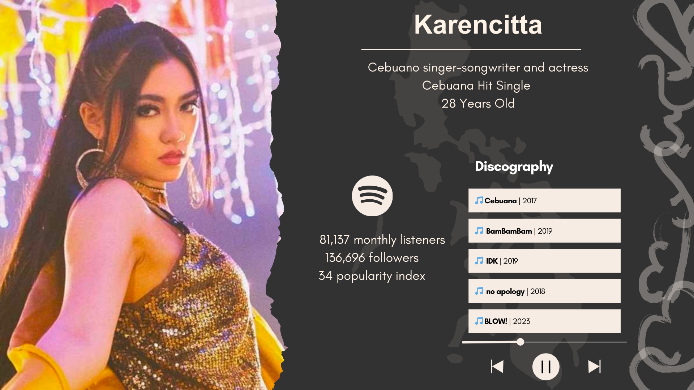
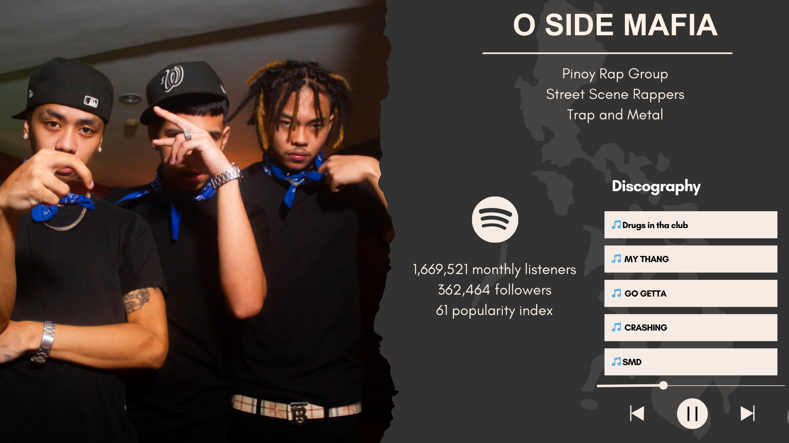

<h1>
  
</h1>

<h1>Authors</h1>
Paula Martinez, Anish Pati, Richard Rian, Jeremiah Soliman, James Zabala

<h1>Project Description</h1>
Imagine an artist approaching a record label company to produce her next song. The company, being data-driven, wants to use Spotify data to explore ways to make her next track successful. This project pioneers the use of data science techniques to explore new pathways for artistic success, with a focus on the acclaimed Filipino artist Karencitta. By leveraging the Spotify API's song dataset and information retrieval methods, the research identifies a set of songs that closely align with Karencitta's chart-topping hit "Cebuana." Through the application of similarity measures like L1 norm, L2 norm, and cosine distance, the analysis uncovers a promising collaboration opportunity between Karencitta and the Manila-based trap metal trio O Side Mafia.

<h1>Karencitta</h1>
Karen Ann “Karencitta” Cabrera, an award-winning recording artist and songwriter from Cebu City, Philippines, has made a significant impact in the music industry with her unique blend of electronic dance and pop music. Her journey to stardom began in earnest in 2017 with the release of her Sinulog Electronic Dance Pop hit ‘Cebuana’. This track not only topped Spotify's Most Viral Music chart in 2017 but also demonstrated her widespread appeal, as evidenced by the music video garnering over 1 million views within the first 24 hours and amassing a total of 26 million views to date.

<h1>Key Takeaway</h1>
The rise of Manila's O Side Mafia during the pandemic lockdowns was a cultural phenomenon, with their angsty trap metal sound providing an expressive outlet for frustrated youth. Their gritty, street-influenced style resonated deeply, drawing local crowds to their impromptu neighborhood shows. This authentic connection positions them as an exciting collaboration opportunity for Karencitta - infusing her music with their fresh energy and innovative soundscapes could amplify her next hit's cultural impact and widespread appeal.

